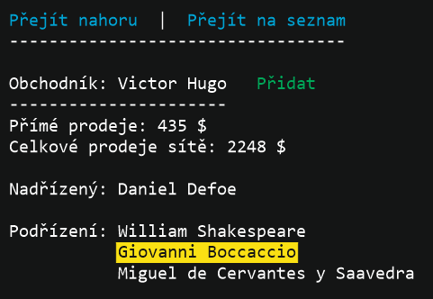
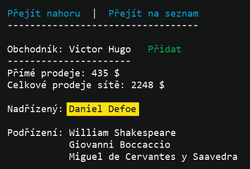
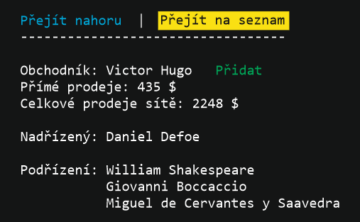
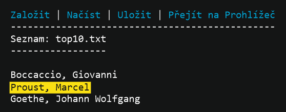
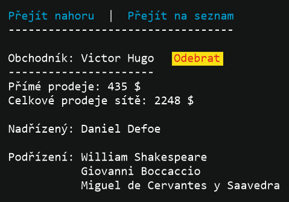

# Prohlížeč obchodní sítě

V zadání máte strukturu obchodní sítě z předchozího úkolu. Existující kód třídy `Salesman` nesmíte měnit, můžete ale přidat další metody.

Vytvořte prohlížeč tohoto stromu a možnost vybírat si z ní a ukládat do textového souboru.

## 1. Interaktivní prohlížeč
* Umožněte uživateli procházet strom interaktivně. Tedy na začátku zobrazte objekt "Šéf",jeho údaje, a také jeho podřízené.
* Kurzorovými klávesami a mezerníkem bude možné přejít na podřízeného nebo nadřízeného.

* V menu stránky bude možné přejít na uživatelský seznam obchodníků (viz níže) a na úplného šéfa.

## 2. Seznam 
*  Umožněte uživateli přidat konkrétního obchodníka na seznam nebo jej z něj smazat.
*  Seznamy ukládejte jako textové soubory v adresáři s aplikací, jejich struktura je na vás - nebo využijte výchozí formát
*  Zobrazení v režimu "seznam" bude nabízet
  *  Založení nového souboru se seznamem, načtení aktuálního a uložení aktuálního seznamu (v menu)
  *  Možnost přejít na šéfa celého stromu (v menu)
  *  Procházení obchodníků na seznamu (kurzorovými klávesami) s možností "Přejít na obchodníka" (např. mezerník), tedy do režimu prohlížeče

*  Při procházení v prohlížeči bude možné obchodníka na seznam přidat nebo odebrat (opět kurzorové klávesy -> zvýraznit pole "přidat" a mezerník). Aktuální stav musí odrážet aktuálně načtený seznam. V případě, že žádný načten/založen není, nelze na seznam přidávat

## 3. Ukončení programu
Přidejte do obou menu možnost program ukončit (případně i vhodnou klávesovou zkratku). Pokud je načten seznam, ale není uložen, varujte u+živatele a zeptejte se ho, jestli chce seznam "muj_vyber.txt" uložit.

## Pokyny ke zpracování
* Problém řešte s použitím tříd a objektů, dělte řešení na rozumné celky - metody
  * Hodně může pomoci chápat "vybratelné" bloky jako tlačítka a jejich skupiny, abstraktní objekty a jejich konkrétní implementace, mít na nich připravenu nějakou akci (Click/Select), kterou polymorfně každé tlačítko přijme/naplní apod. 
* Do souboru `dokumentace.md` přidejte váš první pokud o dokumentaci - Plnohodnotný text s popisem "jak vaše řešení funguje" - jaký je formát dat, jaké jsou v řešení třídy, co znamenají jejich vlastnosti a metody
